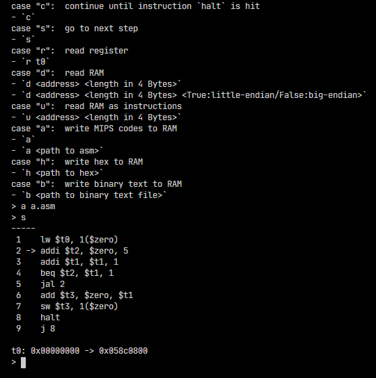
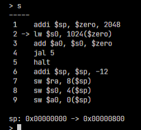

# MIPS

## Introduction



## Features

Log changes:



## Run

1. Set `pwd` to `src/MIPS.Organizer/`
1. Run command `dotnet run`
1. Follow the instructions

### Try existing MIPS code

1. do the instructions above
1. type the following to load MIPS code:

    ```
    a tests/fib.asm
    ```

1. type `s` to do the step-by-step debug
1. type `c` to continue running until it hits `halt` instruction

## Environment

You will need .NET Core SDK to build and run this code.

Download link: <https://dotnet.microsoft.com/download/dotnet-core>.

## Grammar

Due to complexity and current demand, full MIPS code grammar is not supported. For those currently supported instructions, see sections below.

Code segment is parsed directly. No segment label is needed.

Data segment is parsed in the following manner:

```
# data begin
# 1024 2
# 00111111 10000000 00000000 00000010
# 01000000 00000000 00000000 00000100
# 11111111 00000000 00000000 00000000
# 00000000 10000000 00000000 00000000
# data end
```

- `1024` := start from address 1024
- `2` := binary code
- `00111111` := the first byte from the starting address
- bytes should be divided either by spaces or by new line
- no partial byte is allowed

## Currently Supported Instructions

Go to [`README.md`](./src/MIPS.Simulator/README.md) under directory `MIPS.Simulator`.
