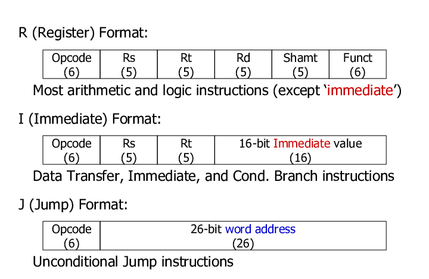
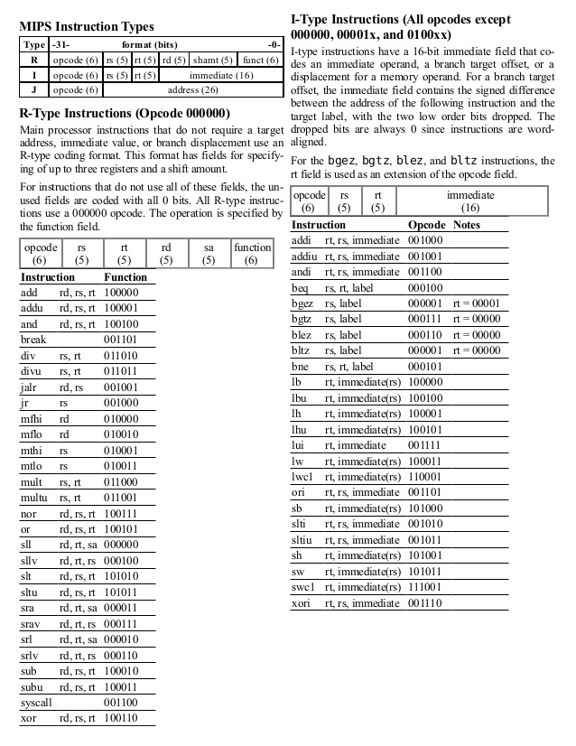
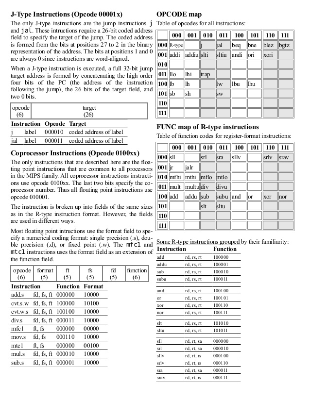

# ANTLR definition

Generate lexer and parser.

## Generate code

Set `pwd` to current folder first. Then run the following command.

<!-- java -jar antlr-4.8-complete.jar -Dlanguage=CSharp -visitor Hello.g4  -->
```
java -jar antlr-4.8-complete.jar -Dlanguage=CSharp -visitor -o MipsToBinary MipsAsm/MipsAsm.g4
```

## Make customized visitor

1. create new class file
1. inherit it from IYOURGRAMMARNAMEVisiter
1. resolve errors
1. inherit it from YOURGRAMMARNAMEBaseVisiter
1. delete unnecessary methods
1. implement remaining methods

## Mips

### Instruction sets

- <http://www.mrc.uidaho.edu/mrc/people/jff/digital/MIPSir.html>

- <http://www.cs.umd.edu/~meesh/cmsc411/mips-pipe/proj-fall11/mips-doc/node2.html>

### Types







- with details - <https://opencores.org/projects/plasma/opcodes>

### Register naming

- <https://www.dsi.unive.it/~gasparetto/materials/MIPS_Instruction_Set.pdf>

### Pseudo instructions

- <https://github.com/MIPT-ILab/mipt-mips/wiki/MIPS-pseudo-instructions>
